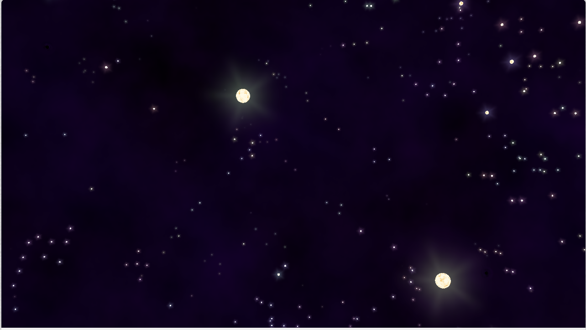
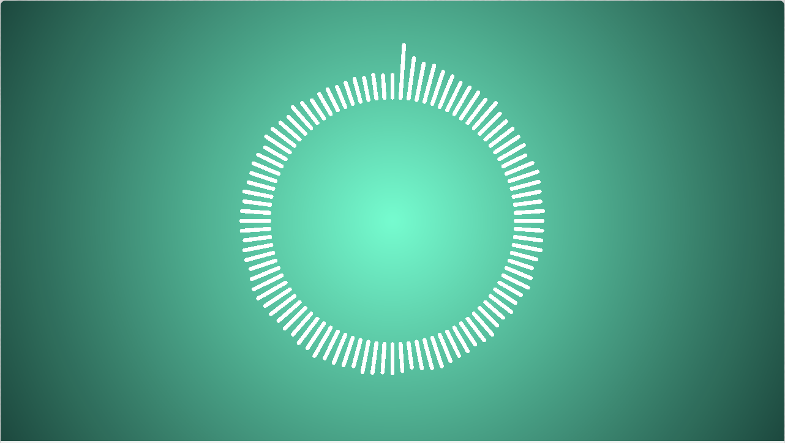
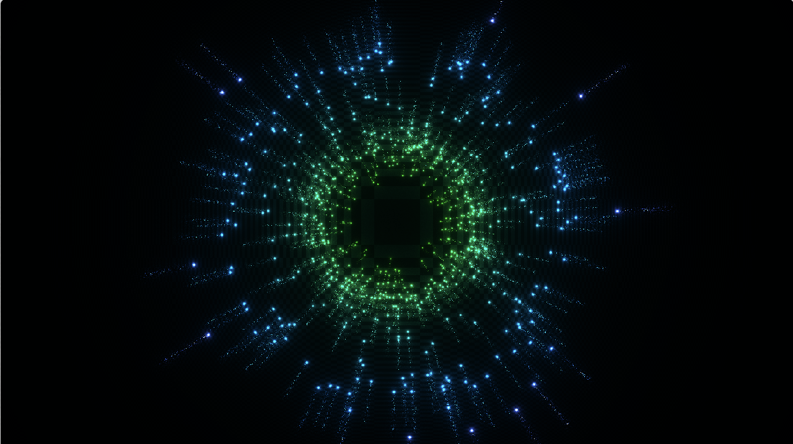

These shaders are from shadertoy

## notes
Each shader on the site has tabs that are labeled:
- Image (Default)
- Sound (Optional)
- Buffer A (Optional)
- Buffer B (Optional)
- Buffer C (Optional)
- Buffer D (Optional)
- Cubemap A (Optional)

And each of the above has a section for shader inputs and a section for the shader code.

For each shader I'll document each tab with a tripple \` code block and give it an annotation matching the tab label. I'll use docblocks `/* input*/` and `/* code */` to label the content of the tab. 

# starfield
Url: https://www.shadertoy.com/view/MtcGDf


"Image" tab
```c
/* Inputs */
uniform vec3      iResolution;           // viewport resolution (in pixels)
uniform float     iTime;                 // shader playback time (in seconds)
uniform float     iTimeDelta;            // render time (in seconds)
uniform float     iFrameRate;            // shader frame rate
uniform int       iFrame;                // shader playback frame
uniform float     iChannelTime[4];       // channel playback time (in seconds)
uniform vec3      iChannelResolution[4]; // channel resolution (in pixels)
uniform vec4      iMouse;                // mouse pixel coords. xy: current (if MLB down), zw: click
uniform samplerXX iChannel0..3;          // input channel. XX = 2D/Cube
uniform vec4      iDate;                 // (year, month, day, time in seconds)

/* Code */
const float FLIGHT_SPEED = 8.0;

const float DRAW_DISTANCE = 60.0; // Lower this to increase framerate
const float FADEOUT_DISTANCE = 10.0; // must be < DRAW_DISTANCE    
const float FIELD_OF_VIEW = 1.05;   

const float STAR_SIZE = 0.6; // must be > 0 and < 1
const float STAR_CORE_SIZE = 0.14;

const float CLUSTER_SCALE = 0.02;
const float STAR_THRESHOLD = 0.775;

const float BLACK_HOLE_CORE_RADIUS = 0.2;
const float BLACK_HOLE_THRESHOLD = 0.9995;
const float BLACK_HOLE_DISTORTION = 0.03;

// http://lolengine.net/blog/2013/07/27/rgb-to-hsv-in-glsl
vec3 hsv2rgb(vec3 c) {
    vec4 K = vec4(1.0, 2.0 / 3.0, 1.0 / 3.0, 3.0);
    vec3 p = abs(fract(c.xxx + K.xyz) * 6.0 - K.www);
    return c.z * mix(K.xxx, clamp(p - K.xxx, 0.0, 1.0), c.y);
}

// https://stackoverflow.com/questions/4200224/random-noise-functions-for-glsl
float rand(vec2 co){
    return fract(sin(dot(co.xy ,vec2(12.9898, 78.233))) * 43758.5453);
}

vec3 getRayDirection(vec2 fragCoord, vec3 cameraDirection) {
    vec2 uv = fragCoord.xy / iResolution.xy;
	
    const float screenWidth = 1.0;
    float originToScreen = screenWidth / 2.0 / tan(FIELD_OF_VIEW / 2.0);
    
    vec3 screenCenter = originToScreen * cameraDirection;
    vec3 baseX = normalize(cross(screenCenter, vec3(0, -1.0, 0)));
    vec3 baseY = normalize(cross(screenCenter, baseX));
    
    return normalize(screenCenter + (uv.x - 0.5) * baseX + (uv.y - 0.5) * iResolution.y / iResolution.x * baseY);
}

float getDistance(ivec3 chunkPath, vec3 localStart, vec3 localPosition) {
    return length(vec3(chunkPath) + localPosition - localStart);
}

void move(inout vec3 localPosition, vec3 rayDirection, vec3 directionBound) {
    vec3 directionSign = sign(rayDirection);
	vec3 amountVector = (directionBound - directionSign * localPosition) / abs(rayDirection);
    
    float amount = min(amountVector.x, min(amountVector.y, amountVector.z));
    
    localPosition += amount * rayDirection;
}

// Makes sure that each component of localPosition is >= 0 and <= 1
void moveInsideBox(inout vec3 localPosition, inout ivec3 chunk, vec3 directionSign, vec3 direcctionBound) {
    const float eps = 0.0000001;
    if (localPosition.x * directionSign.x >= direcctionBound.x - eps) {
        localPosition.x -= directionSign.x;
        chunk.x += int(directionSign.x);
    } else if (localPosition.y * directionSign.y >= direcctionBound.y - eps) {
        localPosition.y -= directionSign.y;
        chunk.y += int(directionSign.y);
    } else if (localPosition.z * directionSign.z >= direcctionBound.z - eps) {
        localPosition.z -= directionSign.z;
        chunk.z += int(directionSign.z);
    }
}

bool hasStar(ivec3 chunk) {
    return texture(iChannel0, mod(CLUSTER_SCALE * (vec2(chunk.xy) + vec2(chunk.zx)) + vec2(0.724, 0.111), 1.0)).r > STAR_THRESHOLD
        && texture(iChannel0, mod(CLUSTER_SCALE * (vec2(chunk.xz) + vec2(chunk.zy)) + vec2(0.333, 0.777), 1.0)).r > STAR_THRESHOLD;
}

bool hasBlackHole(ivec3 chunk) {
    return rand(0.0001 * vec2(chunk.xy) + 0.002 * vec2(chunk.yz)) > BLACK_HOLE_THRESHOLD;
}

vec3 getStarToRayVector(vec3 rayBase, vec3 rayDirection, vec3 starPosition) {
	float r = (dot(rayDirection, starPosition) - dot(rayDirection, rayBase)) / dot(rayDirection, rayDirection);
    vec3 pointOnRay = rayBase + r * rayDirection;
    return pointOnRay - starPosition;
}

vec3 getStarPosition(ivec3 chunk, float starSize) {
    vec3 position = abs(vec3(rand(vec2(float(chunk.x) / float(chunk.y) + 0.24, float(chunk.y) / float(chunk.z) + 0.66)),
                             rand(vec2(float(chunk.x) / float(chunk.z) + 0.73, float(chunk.z) / float(chunk.y) + 0.45)),
                             rand(vec2(float(chunk.y) / float(chunk.x) + 0.12, float(chunk.y) / float(chunk.z) + 0.76))));
    
    return starSize * vec3(1.0) + (1.0 - 2.0 * starSize) * position;
}

vec4 getNebulaColor(vec3 globalPosition, vec3 rayDirection) {
    vec3 color = vec3(0.0);
    float spaceLeft = 1.0;
    
    const float layerDistance = 10.0;
    float rayLayerStep = rayDirection.z / layerDistance;
    
    const int steps = 4;
    for (int i = 0; i <= steps; i++) {
    	vec3 noiseeval = globalPosition + rayDirection * ((1.0 - fract(globalPosition.z / layerDistance) + float(i)) * layerDistance / rayDirection.z);
    	noiseeval.xy += noiseeval.z;
        
        
        float value = 0.06 * texture(iChannel0, fract(noiseeval.xy / 60.0)).r;
         
        if (i == 0) {
            value *= 1.0 - fract(globalPosition.z / layerDistance);
        } else if (i == steps) {
            value *= fract(globalPosition.z / layerDistance);
        }
        
        float hue = mod(noiseeval.z / layerDistance / 34.444, 1.0);
        
        color += spaceLeft * hsv2rgb(vec3(hue, 1.0, value));
        spaceLeft = max(0.0, spaceLeft - value * 2.0);
    }
    return vec4(color, 1.0);
}

vec4 getStarGlowColor(float starDistance, float angle, float hue) {
    float progress = 1.0 - starDistance;
    return vec4(hsv2rgb(vec3(hue, 0.3, 1.0)), 0.4 * pow(progress, 2.0) * mix(pow(abs(sin(angle * 2.5)), 8.0), 1.0, progress));
}

float atan2(vec2 value) {
    if (value.x > 0.0) {
        return atan(value.y / value.x);
    } else if (value.x == 0.0) {
    	return 3.14592 * 0.5 * sign(value.y);   
    } else if (value.y >= 0.0) {
        return atan(value.y / value.x) + 3.141592;
    } else {
        return atan(value.y / value.x) - 3.141592;
    }
}

vec3 getStarColor(vec3 starSurfaceLocation, float seed, float viewDistance) {
    const float DISTANCE_FAR = 20.0;
    const float DISTANCE_NEAR = 15.0;
    
    if (viewDistance > DISTANCE_FAR) {
    	return vec3(1.0);
    }
    
    float fadeToWhite = max(0.0, (viewDistance - DISTANCE_NEAR) / (DISTANCE_FAR - DISTANCE_NEAR));
    
    vec3 coordinate = vec3(acos(starSurfaceLocation.y), atan2(starSurfaceLocation.xz), seed);
    
    float progress = pow(texture(iChannel0, fract(0.3 * coordinate.xy + seed * vec2(1.1))).r, 4.0);
    
    return mix(mix(vec3(1.0, 0.98, 0.9), vec3(1.0, 0.627, 0.01), progress), vec3(1.0), fadeToWhite);
}

vec4 blendColors(vec4 front, vec4 back) {
  	return vec4(mix(back.rgb, front.rgb, front.a / (front.a + back.a)), front.a + back.a - front.a * back.a);
}

void mainImage(out vec4 fragColor, in vec2 fragCoord) {
    vec3 movementDirection = normalize(vec3(0.01, 0.0, 1.0));
    
    vec3 rayDirection = getRayDirection(fragCoord, movementDirection);
    vec3 directionSign = sign(rayDirection);
    vec3 directionBound = vec3(0.5) + 0.5 * directionSign;
    
    vec3 globalPosition = vec3(3.14159, 3.14159, 0.0) + (iTime + 1000.0) * FLIGHT_SPEED * movementDirection;
    ivec3 chunk = ivec3(globalPosition);
    vec3 localPosition = mod(globalPosition, 1.0);
    moveInsideBox(localPosition, chunk, directionSign, directionBound);
    
    ivec3 startChunk = chunk;
    vec3 localStart = localPosition;
    
    fragColor = vec4(0.0);
    
    for (int i = 0; i < 200; i++) {
        move(localPosition, rayDirection, directionBound);
        moveInsideBox(localPosition, chunk, directionSign, directionBound);
        
        if (hasStar(chunk)) {
            vec3 starPosition = getStarPosition(chunk, 0.5 * STAR_SIZE);
			float currentDistance = getDistance(chunk - startChunk, localStart, starPosition);
            if (currentDistance > DRAW_DISTANCE && false) {
                break;
            }
            
            // This vector points from the center of the star to the closest point on the ray (orthogonal to the ray)
            vec3 starToRayVector = getStarToRayVector(localPosition, rayDirection, starPosition);
            // Distance between ray and star
            float distanceToStar = length(starToRayVector);
            distanceToStar *= 2.0;
            
            if (distanceToStar < STAR_SIZE) {
                float starMaxBrightness = clamp((DRAW_DISTANCE - currentDistance) / FADEOUT_DISTANCE, 0.001, 1.0);
            	
                float starColorSeed = (float(chunk.x) + 13.0 * float(chunk.y) + 7.0 * float(chunk.z)) * 0.00453;
                if (distanceToStar < STAR_SIZE * STAR_CORE_SIZE) {
                    // This vector points from the center of the star to the point of the star sphere surface that this ray hits
            		vec3 starSurfaceVector = normalize(starToRayVector + rayDirection * sqrt(pow(STAR_CORE_SIZE * STAR_SIZE, 2.0) - pow(distanceToStar, 2.0)));
					
                    fragColor = blendColors(fragColor, vec4(getStarColor(starSurfaceVector, starColorSeed, currentDistance), starMaxBrightness));                    
                    break;
                } else {
                    float localStarDistance = ((distanceToStar / STAR_SIZE) - STAR_CORE_SIZE) / (1.0 - STAR_CORE_SIZE);
                    vec4 glowColor = getStarGlowColor(localStarDistance, atan2(starToRayVector.xy), starColorSeed);
                    glowColor.a *= starMaxBrightness;
                	fragColor = blendColors(fragColor, glowColor);
                }
            }
        } else if (hasBlackHole(chunk)) {
            const vec3 blackHolePosition = vec3(0.5);
			float currentDistance = getDistance(chunk - startChunk, localStart, blackHolePosition);
            float fadeout = min(1.0, (DRAW_DISTANCE - currentDistance) / FADEOUT_DISTANCE);
            	
            // This vector points from the center of the black hole to the closest point on the ray (orthogonal to the ray)
            vec3 coreToRayVector = getStarToRayVector(localPosition, rayDirection, blackHolePosition);
            float distanceToCore = length(coreToRayVector);
            if (distanceToCore < BLACK_HOLE_CORE_RADIUS * 0.5) {
                fragColor = blendColors(fragColor, vec4(vec3(0.0), fadeout));
                break;
            } else if (distanceToCore < 0.5) {
            	rayDirection = normalize(rayDirection - fadeout * (BLACK_HOLE_DISTORTION / distanceToCore - BLACK_HOLE_DISTORTION / 0.5) * coreToRayVector / distanceToCore);
            }
        }
        
        if (length(vec3(chunk - startChunk)) > DRAW_DISTANCE) {
            break;
        }
    }
    
    if (fragColor.a < 1.0) {
    	fragColor = blendColors(fragColor, getNebulaColor(globalPosition, rayDirection));
    }
}
```

"Buffer A" tab
```c
/* input */
uniform vec3      iResolution;           // viewport resolution (in pixels)
uniform float     iTime;                 // shader playback time (in seconds)
uniform float     iTimeDelta;            // render time (in seconds)
uniform float     iFrameRate;            // shader frame rate
uniform int       iFrame;                // shader playback frame
uniform float     iChannelTime[4];       // channel playback time (in seconds)
uniform vec3      iChannelResolution[4]; // channel resolution (in pixels)
uniform vec4      iMouse;                // mouse pixel coords. xy: current (if MLB down), zw: click
uniform samplerXX iChannel0..3;          // input channel. XX = 2D/Cube
uniform vec4      iDate;                 // (year, month, day, time in seconds)

/* code */
//
// Description : Array and textureless GLSL 2D/3D/4D simplex 
//               noise functions.
//      Author : Ian McEwan, Ashima Arts.
//  Maintainer : stegu
//     Lastmod : 20110822 (ijm)
//     License : Copyright (C) 2011 Ashima Arts. All rights reserved.
//               Distributed under the MIT License. See LICENSE file.
//               https://github.com/ashima/webgl-noise
//               https://github.com/stegu/webgl-noise
// 
    vec3 mod289(vec3 x) {
      return x - floor(x * (1.0 / 289.0)) * 289.0;
    }

    vec4 mod289(vec4 x) {
      return x - floor(x * (1.0 / 289.0)) * 289.0;
    }

    vec4 permute(vec4 x) {
         return mod289(((x*34.0)+1.0)*x);
    }

    vec4 taylorInvSqrt(vec4 r)
    {
      return 1.79284291400159 - 0.85373472095314 * r;
    }

    float snoise(vec3 v)
      { 
      const vec2  C = vec2(1.0/6.0, 1.0/3.0) ;
      const vec4  D = vec4(0.0, 0.5, 1.0, 2.0);

    // First corner
      vec3 i  = floor(v + dot(v, C.yyy) );
      vec3 x0 =   v - i + dot(i, C.xxx) ;

    // Other corners
      vec3 g = step(x0.yzx, x0.xyz);
      vec3 l = 1.0 - g;
      vec3 i1 = min( g.xyz, l.zxy );
      vec3 i2 = max( g.xyz, l.zxy );

      //   x0 = x0 - 0.0 + 0.0 * C.xxx;
      //   x1 = x0 - i1  + 1.0 * C.xxx;
      //   x2 = x0 - i2  + 2.0 * C.xxx;
      //   x3 = x0 - 1.0 + 3.0 * C.xxx;
      vec3 x1 = x0 - i1 + C.xxx;
      vec3 x2 = x0 - i2 + C.yyy; // 2.0*C.x = 1/3 = C.y
      vec3 x3 = x0 - D.yyy;      // -1.0+3.0*C.x = -0.5 = -D.y

    // Permutations
      i = mod289(i); 
      vec4 p = permute( permute( permute( 
                 i.z + vec4(0.0, i1.z, i2.z, 1.0 ))
               + i.y + vec4(0.0, i1.y, i2.y, 1.0 )) 
               + i.x + vec4(0.0, i1.x, i2.x, 1.0 ));

    // Gradients: 7x7 points over a square, mapped onto an octahedron.
    // The ring size 17*17 = 289 is close to a multiple of 49 (49*6 = 294)
      float n_ = 0.142857142857; // 1.0/7.0
      vec3  ns = n_ * D.wyz - D.xzx;

      vec4 j = p - 49.0 * floor(p * ns.z * ns.z);  //  mod(p,7*7)

      vec4 x_ = floor(j * ns.z);
      vec4 y_ = floor(j - 7.0 * x_ );    // mod(j,N)

      vec4 x = x_ *ns.x + ns.yyyy;
      vec4 y = y_ *ns.x + ns.yyyy;
      vec4 h = 1.0 - abs(x) - abs(y);

      vec4 b0 = vec4( x.xy, y.xy );
      vec4 b1 = vec4( x.zw, y.zw );

      //vec4 s0 = vec4(lessThan(b0,0.0))*2.0 - 1.0;
      //vec4 s1 = vec4(lessThan(b1,0.0))*2.0 - 1.0;
      vec4 s0 = floor(b0)*2.0 + 1.0;
      vec4 s1 = floor(b1)*2.0 + 1.0;
      vec4 sh = -step(h, vec4(0.0));

      vec4 a0 = b0.xzyw + s0.xzyw*sh.xxyy ;
      vec4 a1 = b1.xzyw + s1.xzyw*sh.zzww ;

      vec3 p0 = vec3(a0.xy,h.x);
      vec3 p1 = vec3(a0.zw,h.y);
      vec3 p2 = vec3(a1.xy,h.z);
      vec3 p3 = vec3(a1.zw,h.w);

    //Normalise gradients
      vec4 norm = taylorInvSqrt(vec4(dot(p0,p0), dot(p1,p1), dot(p2, p2), dot(p3,p3)));
      p0 *= norm.x;
      p1 *= norm.y;
      p2 *= norm.z;
      p3 *= norm.w;

    // Mix final noise value
      vec4 m = max(0.6 - vec4(dot(x0,x0), dot(x1,x1), dot(x2,x2), dot(x3,x3)), 0.0);
      m = m * m;
      return 42.0 * dot( m*m, vec4( dot(p0,x0), dot(p1,x1), 
                                    dot(p2,x2), dot(p3,x3)));
	}

float tilingNoise(vec2 position, float size) {
    float value = snoise(vec3(position * size, 0.0));
    
    float wrapx = snoise(vec3(position * size - vec2(size, 0.0), 0.0));    
    value = mix(value, wrapx, max(0.0, position.x * size - (size - 1.0)));

    float wrapy = snoise(vec3(position * size - vec2(0.0, size), 0.0));
    float wrapxy = snoise(vec3(position * size - vec2(size, size), 0.0)); 
    wrapy = mix(wrapy, wrapxy, max(0.0, position.x * size - (size - 1.0)));
	return mix(value, wrapy, max(0.0, position.y * size - (size - 1.0)));
}

void initialize(out vec4 fragColor, in vec2 fragCoord) {
    vec2 uv = fragCoord / iResolution.xy;
    
    const int octaves = 6;
    
    float value = 0.0;
  	float maxValue = 0.0; 
    for (float octave = 0.0; octave < float(octaves); octave++) {
    	value += pow(2.0, -octave) * tilingNoise(uv, 8.0 * pow(2.0, octave));
        maxValue += pow(2.0, -octave);
    }
    
    maxValue *= 0.5;
    
    fragColor = vec4(0.5 * (1.0 + value / maxValue) * vec3(1.0), 1.0);
    fragColor.g = iResolution.x;
}

void mainImage(out vec4 fragColor, in vec2 fragCoord) {
    fragColor = texture(iChannel0, fragCoord / iResolution.xy);
    if (fragColor.g != iResolution.x) {
    	initialize(fragColor, fragCoord);
    }
}
```

# singularity
Url: https://www.shadertoy.com/view/3csSWB


"Image" tab
```c 
/* input */
uniform vec3      iResolution;           // viewport resolution (in pixels)
uniform float     iTime;                 // shader playback time (in seconds)
uniform float     iTimeDelta;            // render time (in seconds)
uniform float     iFrameRate;            // shader frame rate
uniform int       iFrame;                // shader playback frame
uniform float     iChannelTime[4];       // channel playback time (in seconds)
uniform vec3      iChannelResolution[4]; // channel resolution (in pixels)
uniform vec4      iMouse;                // mouse pixel coords. xy: current (if MLB down), zw: click
uniform samplerXX iChannel0..3;          // input channel. XX = 2D/Cube
uniform vec4      iDate;                 // (year, month, day, time in seconds)

/* code */
/*
    "Singularity" by @XorDev

    A whirling blackhole.
    Feel free to code golf!
    
    FabriceNeyret2: -19
    dean_the_coder: -12
    iq: -4
*/
void mainImage(out vec4 O, vec2 F)
{
    //Iterator and attenuation (distance-squared)
    float i = .2, a;
    //Resolution for scaling and centering
    vec2 r = iResolution.xy,
         //Centered ratio-corrected coordinates
         p = ( F+F - r ) / r.y / .7,
         //Diagonal vector for skewing
         d = vec2(-1,1),
         //Blackhole center
         b = p - i*d,
         //Rotate and apply perspective
         c = p * mat2(1, 1, d/(.1 + i/dot(b,b))),
         //Rotate into spiraling coordinates
         v = c * mat2(cos(.5*log(a=dot(c,c)) + iTime*i + vec4(0,33,11,0)))/i,
         //Waves cumulative total for coloring
         w;
    
    //Loop through waves
    for(; i++<9.; w += 1.+sin(v) )
        //Distort coordinates
        v += .7* sin(v.yx*i+iTime) / i + .5;
    //Acretion disk radius
    i = length( sin(v/.3)*.4 + c*(3.+d) );
    //Red/blue gradient
    O = 1. - exp( -exp( c.x * vec4(.6,-.4,-1,0) )
                   //Wave coloring
                   /  w.xyyx
                   //Acretion disk brightness
                   / ( 2. + i*i/4. - i )
                   //Center darkness
                   / ( .5 + 1. / a )
                   //Rim highlight
                   / ( .03 + abs( length(p)-.7 ) )
             );
    }


//Original [432]
/*
void mainImage(out vec4 O,in vec2 F)
{
    vec2 p=(F*2.-iResolution.xy)/(iResolution.y*.7),
    d=vec2(-1,1),
    c=p*mat2(1,1,d/(.1+5./dot(5.*p-d,5.*p-d))),
    v=c;
    v*=mat2(cos(log(length(v))+iTime*.2+vec4(0,33,11,0)))*5.;
    vec4 o=vec4(0);
    for(float i;i++<9.;o+=sin(v.xyyx)+1.)
    v+=.7*sin(v.yx*i+iTime)/i+.5;
    O=1.-exp(-exp(c.x*vec4(.6,-.4,-1,0))/o
    /(.1+.1*pow(length(sin(v/.3)*.2+c*vec2(1,2))-1.,2.))
    /(1.+7.*exp(.3*c.y-dot(c,c)))
    /(.03+abs(length(p)-.7))*.2);
}*/
```

# Round Audio Spectrum Remastered
Url: https://www.shadertoy.com/view/ldtBRN


"Image" tab
```c
/* input */
niform vec3      iResolution;           // viewport resolution (in pixels)
uniform float     iTime;                 // shader playback time (in seconds)
uniform float     iTimeDelta;            // render time (in seconds)
uniform float     iFrameRate;            // shader frame rate
uniform int       iFrame;                // shader playback frame
uniform float     iChannelTime[4];       // channel playback time (in seconds)
uniform vec3      iChannelResolution[4]; // channel resolution (in pixels)
uniform vec4      iMouse;                // mouse pixel coords. xy: current (if MLB down), zw: click
uniform samplerXX iChannel0..3;          // input channel. XX = 2D/Cube
uniform vec4      iDate;                 // (year, month, day, time in seconds)

/* code */
#define M_PI 3.14159265359

vec4 rectangle(vec4 color, vec4 background, vec4 region, vec2 uv);
vec4 capsule(vec4 color, vec4 background, vec4 region, vec2 uv);
vec2 rotate(vec2 point, vec2 center, float angle);
vec4 bar(vec4 color, vec4 background, vec2 position, vec2 diemensions, vec2 uv);
vec4 rays(vec4 color, vec4 background, vec2 position, float radius, float rays, float ray_length, sampler2D sound, vec2 uv);

void mainImage( out vec4 fragColor, in vec2 fragCoord )
{
    //Prepare UV and background
    float aspect = iResolution.x / iResolution.y;
    vec2 uv = fragCoord/iResolution.xy;
    uv.x *= aspect;
    vec4 color = mix(vec4(0.0, 1.0, 0.8, 1.0), vec4(0.0, 0.3, 0.25, 1.0), distance(vec2(aspect/2.0, 0.5), uv));
    
    //VISUALIZER PARAMETERS
    const float RAYS = 96.0; //number of rays //Please, decrease this value if shader is working too slow
    float RADIUS = 0.4; //max circle radius
    float RAY_LENGTH = 0.3; //ray's max length //increased by 0.1
    
    color = rays(vec4(1.0), color, vec2(aspect/2.0, 1.0/2.0), RADIUS, RAYS, RAY_LENGTH, iChannel0, uv);
    
    fragColor = color;
}

vec4 rays(vec4 color, vec4 background, vec2 position, float radius, float rays, float ray_length, sampler2D sound, vec2 uv)
{
    float inside = (1.0 - ray_length) * radius; //empty part of circle
    float outside = radius - inside; //rest of circle
    float circle = 2.0*M_PI*inside; //circle lenght
    for(int i = 1; float(i) <= rays; i++)
    {
        float len = outside * texture(sound, vec2(float(i)/rays, 0.0)).x; //length of actual ray
        background = bar(color, background, vec2(position.x, position.y+inside), vec2(circle/(rays*2.0), len), rotate(uv, position, 360.0/rays*float(i))); //Added capsules
    }
    return background; //output
}

vec4 bar(vec4 color, vec4 background, vec2 position, vec2 diemensions, vec2 uv)
{
    return capsule(color, background, vec4(position.x, position.y+diemensions.y/2.0, diemensions.x/2.0, diemensions.y/2.0), uv); //Just transform rectangle a little
}

vec4 capsule(vec4 color, vec4 background,  vec4 region, vec2 uv) //capsule
{
    if(uv.x > (region.x-region.z) && uv.x < (region.x+region.z) &&
       uv.y > (region.y-region.w) && uv.y < (region.y+region.w) || 
       distance(uv, region.xy - vec2(0.0, region.w)) < region.z || 
       distance(uv, region.xy + vec2(0.0, region.w)) < region.z)
        return color;
    return background;
}

vec2 rotate(vec2 point, vec2 center, float angle) //rotating point around the center
{
    float s = sin(radians(angle));
    float c = cos(radians(angle));
    
    point.x -= center.x;
    point.y -= center.y;
    
    float x = point.x * c - point.y * s;
    float y = point.x * s + point.y * c;
    
    point.x = x + center.x;
    point.y = y + center.y;
    
    return point;
}
```

# Particles Dance
Url: https://www.shadertoy.com/view/MdfBz7


"Image" tab
```c
/* input */
Shader Inputs
uniform vec3      iResolution;           // viewport resolution (in pixels)
uniform float     iTime;                 // shader playback time (in seconds)
uniform float     iTimeDelta;            // render time (in seconds)
uniform float     iFrameRate;            // shader frame rate
uniform int       iFrame;                // shader playback frame
uniform float     iChannelTime[4];       // channel playback time (in seconds)
uniform vec3      iChannelResolution[4]; // channel resolution (in pixels)
uniform vec4      iMouse;                // mouse pixel coords. xy: current (if MLB down), zw: click
uniform samplerXX iChannel0..3;          // input channel. XX = 2D/Cube
uniform vec4      iDate;                 // (year, month, day, time in seconds)

/* code */
#define M_PI 3.1415926535897932384626433832795

float random(vec2 co)
{
    highp float a = 12.9898;
    highp float b = 78.233;
    highp float c = 43758.5453;
    highp float dt= dot(co.xy ,vec2(a,b));
    highp float sn= mod(dt,3.14);
    return fract(sin(sn) * c);
}

void mainImage( out vec4 fragColor, in vec2 fragCoord )
{    
    vec4 outColor = vec4(0.0);
	float time = iTime * 0.1;    
    vec2 uvNorm = fragCoord.xy / iResolution.xy;
	vec2 uv = -0.5 + 1.0 * uvNorm;
    uv /= vec2(iResolution.y / iResolution.x, 1.);
	   
    for(float i=0.0; i<600.0 ;i++){
        float f1 = mod(i * 0.101213, 0.28);   
        float fft1 = texture(iChannel0, vec2(f1)).x;  
        float r = (fft1 / 2.);
        float r1 = (fft1 / 8.) * random(vec2(uv));
        float a = random(vec2(i))*(M_PI*2.);      
        vec2 center = vec2(cos(a), sin(a)) * r;
        vec2 center2 = vec2(cos(a), sin(a)) * r1;        
        float dist = length(uv - center);
        float dist2 = length(uv - center - center2);        
        float birghtness = 1./pow(0.001 + dist*350., 2.);
        float birghtness2 = 1./pow(0.001 + dist2*500., 2.);        
        vec3 color = vec3(fft1-0.8, 0.3, fft1-0.2);
        vec3 col = color * birghtness2 * fft1 * 2.;
        col += color * birghtness * fft1 * 1.5;      
        //Out :D
        outColor.rgb += col;       
    } 
    
    
    float grid = smoothstep((sin(length(uv.y-0.5)*(800.*length(uv.y+0.5))) * sin(length(uv.x+0.5)*(800.*length(uv.x-0.5)))), 0.0, 1.0);
    outColor.rgb += (outColor.rgb * vec3(grid) * 0.6);
    
	fragColor = outColor;
}
```

# Iridescent Rounded Voronoi 
Url: https://www.shadertoy.com/view/ttlSDl
![screenshot][iridescent.png]

"Image" tab
```c
/* input */
uniform vec3      iResolution;           // viewport resolution (in pixels)
uniform float     iTime;                 // shader playback time (in seconds)
uniform float     iTimeDelta;            // render time (in seconds)
uniform float     iFrameRate;            // shader frame rate
uniform int       iFrame;                // shader playback frame
uniform float     iChannelTime[4];       // channel playback time (in seconds)
uniform vec3      iChannelResolution[4]; // channel resolution (in pixels)
uniform vec4      iMouse;                // mouse pixel coords. xy: current (if MLB down), zw: click
uniform samplerXX iChannel0..3;          // input channel. XX = 2D/Cube
uniform vec4      iDate;                 // (year, month, day, time in seconds)

/* code */
// base code from shane : https://www.shadertoy.com/view/4sdcDN
// fork of my : https://www.shadertoy.com/view/tslXWX

const float _threshold = 0.0;
const vec3 _cellColor = vec3(0.2,0.6,0.7);
const float _zoom = 1.0;

float objID; // The rounded web lattice, or the individual Voronoi cells.
vec2 cellID;

mat2 r2(in float a){ float c = cos(a), s = sin(a); return mat2(c, -s, s, c); }

float smin2(float a, float b, float r)
{
   float f = max(0., 1. - abs(b - a)/r);
   return min(a, b) - r*.25*f*f;
}

vec2 hash22H(vec2 p) 
{ 
    float n = sin(dot(p, vec2(41, 289)));
    p = fract(vec2(262144, 32768)*n);
    return sin( p*6.2831853 + iTime )*.3660254 + .5; 
}

vec2 pixToHex(vec2 p)
{
    return floor(vec2(p.x + .57735*p.y, 1.1547*p.y));
}

vec2 hexPt(vec2 p) 
{
    return vec2(p.x - p.y*.5, .866025*p.y) + (hash22H(p) - .5)*.866025/2.;
    
}

vec3 Voronoi(vec2 p)
{
    vec2 pH = pixToHex(p); // Map the pixel to the hex grid.
	const vec2 hp[7] = vec2[7](vec2(-1), vec2(0, -1), vec2(-1, 0), vec2(0), vec2(1), vec2(1, 0), vec2(0, 1)); 
    vec2 minCellID = vec2(0); // Redundant initialization, but I've done it anyway.
	vec2 mo, o;
    float md = 8., lMd = 8., lMd2 = 8., lnDist, d;
    for (int i=0; i<7; i++)
	{
        vec2 h = hexPt(pH + hp[i]) - p;
    	d = dot(h, h);
    	if( d<md )
		{
            md = d;  // Update the minimum distance.
            mo = h; 
            minCellID = hp[i]; // Record the minimum distance cell ID.
        }
    }

	float r = mix(0.0,0.4,sin(iTime * 0.5)*0.5+0.5);
    
	if (iMouse.z > 0.0)
		r = mix(0.0,0.4,iMouse.x/iResolution.x);
    
    for (int i=0; i<7; i++)
	{
        vec2 h = hexPt(pH + hp[i] + minCellID) - p - mo; // Note the "-mo" to save some operations. 
        if(dot(h, h)>.00001){
            lnDist = dot(mo + h*.5, normalize(h));
            lMd = smin2(lMd, lnDist, (lnDist*.5 + .5)*r);
            lMd2 = min(lMd2, lnDist);
			cellID = vec2(lMd);
        }
    }

    float t = iTime * 5.;
    d = lMd * 25.;
    mo -= vec2(cos(d + t),sin(d + t)) / d;
    lMd2 = length(mo);
	
    return max(vec3(lMd, lMd2, md), 0.);
}

float bumpFunc(vec2 p)
{
    vec3 v = Voronoi(p);
    float c = v.x; // Rounded edge value.
    float ew = _threshold; // Border threshold value. Bigger numbers mean thicker borders.
    if(c<ew)
	{ 
        objID = 1.; // Voronoi web border ID.
        c = abs(c - ew)/ew; // Normalize the domain to a range of zero to one.
        c = smoothstep(0., .25, c)/4. + clamp(-cos(c*6.283*1.5) - .5, 0., 1.);
    }
    else 
	{ // Over the threshold? Use the regular Voronoi cell value.
        objID = 0.;
        c = mix(v.x,  v.y, .75); // A mixture of rounded and straight edge values.
        c = (c - ew)/(1. - ew); // Normalize the domain to a range of zero to one.
        c = clamp(c + cos(c*6.283*24.)*.002, 0., 1.); // Add some ridges.
    }
    return c; // Return the object (bordered Voronoi) value.
}

void mainImage( out vec4 fragColor, in vec2 fragCoord )
{
	cellID = vec2(0);
	vec2 uv = (fragCoord - iResolution.xy*.5)/min(iResolution.y, 800.) * _zoom;
    vec2 aspect = vec2(iResolution.y/iResolution.x, 1);
    uv *= 1. + dot(uv*aspect, uv*aspect)*.05;
    vec3 r = normalize(vec3(uv.xy, 1.));
    vec2 p = uv*3.5 + vec2(0, iTime*.5);
    float c = bumpFunc(p);
    float svObjID = objID; 
    vec3 sp = vec3(p, 0.);
    vec3 lp = sp + vec3(-1.3*sin(iTime/2.), .8*cos(iTime/2.), -.5);
    vec3 lp2 = sp + vec3(1.3*sin(iTime/2.), -.8*cos(iTime/2.), -.5);
    sp.z -= c*.1;
    vec2 e = vec2(8./iResolution.y, 0); // Sample spred.
    float bf = .4; // Bump factor.
    if (svObjID>.5) { e.x = 2./iResolution.y; }
    float fx = (bumpFunc(p - e) - bumpFunc(p + e)); // Nearby horizontal samples.
    float fy = (bumpFunc(p - e.yx) - bumpFunc(p + e.yx)); // Nearby vertical samples.
	vec3 n = normalize(vec3(fx, fy, -e.x/bf)); // Bumped normal.
    float edge = abs(c*2. - fx) + abs(c*2. - fy); // Edge value.
    vec3 tx = texture(iChannel0, (p + n.xy*.125)*.25).xyz; tx *= tx; // sRGB to linear.
    tx = smoothstep(0., .5, tx); // Accentuating the color a bit.
    vec3 oCol = tx; 
    if(svObjID>.5)
	{
        oCol *= 1.-_cellColor;
    }   
    else
	{
        oCol *= _cellColor; 
    }
	
	oCol.xy *= cellID * 10.;
	
    float lDist = length(lp - sp); // Light distance one.
    float atten = 1./(1. + lDist*lDist*.5); // Light one attenuation.
    vec3 l = (lp - sp)/max(lDist, .001); // Light one direction (normalized).
	float diff = max(max(dot(l, n), 0.), 0.); // Diffuse value one.
    float spec = pow(max(dot(reflect(l, n), r), 0.), 64.); // Specular value one.
    
    float lDist2 = length(lp2 - sp); // Light distance two.
    float atten2 = 1./(1. + lDist2*lDist2*.5); // Light two attenuation.
    vec3 l2 = (lp2 - sp)/max(lDist2, .001); // Light two direction (normalized).
	float diff2 = max(max(dot(l2, n), 0.), 0.); // Diffuse value two.
    float spec2 = pow(max(dot(reflect(l2, n), r), 0.), 64.); // Specular value twp.
    
    diff = pow(diff, 4.)*2.;
    diff2 = pow(diff2, 4.)*2.;

    vec3 col = oCol*(diff*vec3(.5, .7, 1) + .25 + vec3(.25, .5, 1)*spec*32.)*atten*.5;
    
    col += oCol*(diff2*vec3(1, .7, .5) + .25 + vec3(1, .3, .1)*spec2*32.)*atten2*.5;

	if(svObjID>.5)
	{
        col *= edge;
    }   
    else 
	{
        col /= edge;
    }
        
    vec2 u = fragCoord/iResolution.xy;
    col *= pow(16.*u.x*u.y*(1. - u.x)*(1. - u.y) , .125);

    fragColor = vec4(sqrt(max(col, 0.)), 1);
}
```

# reserved